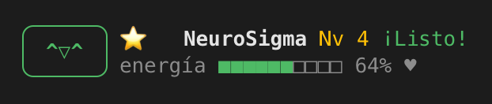
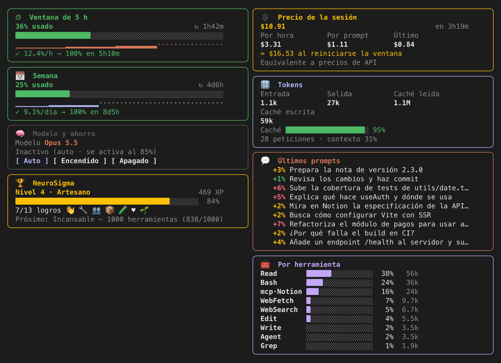
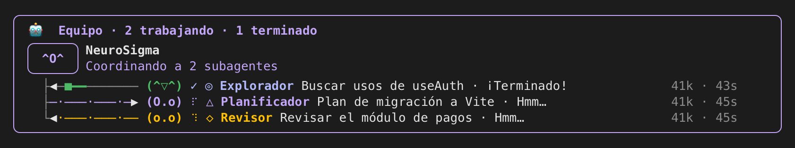

# consumo

Un mod para [Claude Code](https://claude.com/claude-code) que te enseña cuánto
llevas gastado de tu suscripción y cuánto te queda, ahorra cuando te acercas al
límite y te acompaña con **NeuroSigma**, una mascota que reacciona a lo que hace
Claude y a sus subagentes.

<p align="center">
  
</p>

## Instalación

En Claude Code (terminal), escribe:

```
/plugin install consumo --marketplace Chamete/claude-stats
```

Responde `y` para añadir el marketplace y elige el alcance **user**. Queda
activo al momento y en todas las sesiones siguientes.

Para actualizar a la última versión: `claude plugin update consumo` y después
`/reload-plugins`.

> Necesita una versión de Claude Code con soporte de mods (2.1.291 o posterior).
> Las ventanas de 5 h y semanal solo aparecen si inicias sesión con una
> suscripción; con una clave de API verás tokens y precio, sin ventanas.

## Qué incluye

### Panel `/consumo`



| Tarjeta | Qué enseña |
| --- | --- |
| ⏱ Ventana de 5 h | % usado, lo que queda, cuándo se reinicia, gráfico y predicción de si llegarás al límite antes del reinicio |
| 📅 Semana | Lo mismo para la ventana de 7 días, con ritmo diario |
| 💲 Precio | Coste de la sesión (equivalente a precios de API), por hora, por prompt, el último, y proyección hasta el reinicio |
| 🔢 Tokens | Entrada, salida, caché leída y escrita, y % servido desde caché |
| 💬 Últimos prompts | Cuánto % de la ventana, tokens y precio gastó cada prompt |
| 🧰 Tokens por herramienta | Qué herramientas se llevan los tokens de la sesión (Read, Bash, Agent, cada servidor MCP…): % del total, tokens, llamadas y errores |
| 🧠 Modelo y ahorro | El modelo que responde ahora (con 🌱 si el modo ahorro lo ha cambiado) y botones para el modo ahorro |
| 🏆 Mascota | Nivel, experiencia hasta el siguiente y logros conseguidos |
| 🤖 Equipo | Aparece cuando hay subagentes: uno por subagente, con cables animados por los que viajan las tareas, el progreso y los resultados |



El panel se adapta al ancho (1, 2 o 3 columnas) y al alto de la terminal.

#### Personalizar las tarjetas

Pulsa **⚙ Personalizar** al pie del panel: cada tarjeta tiene
botones **↑ ↓** para moverla y **Ocultar / Mostrar**, y el panel cambia al
momento. Con un orden propio las tarjetas se colocan de izquierda a derecha y
de arriba abajo. Tu disposición se guarda en tu equipo y se mantiene entre
sesiones.

También escribiendo:

- `/tarjetas` — el orden actual
- `/tarjetas orden progreso 5h semana precio tokens herramientas prompts modelo` — las que nombres van primero, en ese orden
- `/tarjetas ocultar tokens` / `/tarjetas mostrar tokens`
- `/tarjetas restablecer` — como venían

### Modo ahorro `/ahorro`

Al llegar al **85 %** de la ventana de 5 h (el umbral se puede cambiar, ver abajo), cambia las peticiones de Opus/Fable a
**Sonnet 5.5** y baja el esfuerzo alto a medio, para que la ventana te dure.

- `/ahorro auto` — se activa solo al llegar al umbral (por defecto)
- `/ahorro on` — encendido: activo siempre, gastes lo que gastes
- `/ahorro off` — nunca
- `/ahorro umbral 90` — cambia el porcentaje al que se activa el modo auto (de 50 a 99; por defecto 85)

### Mascota `/mascota`

NeuroSigma vive encima del prompt y reacciona a lo que pasa: piensa, lee,
escribe, ejecuta comandos, busca en la web, coordina subagentes, se alegra al
terminar, se pone triste si algo falla, se duerme tras 5 minutos sin actividad y
se cansa cuando te queda poca ventana. Pulsa ♥ para acariciarla. También
reconoce tus `git commit` y cuando pasas tests.

Gana experiencia con cada prompt, herramienta, subagente, commit y caricia, y
sube de nivel (de *Bebé* a *Leyenda*). Hay 13 logros por desbloquear; al
conseguir uno o subir de nivel te avisa y lo celebra.

- `/mascota off` / `/mascota on` — ocultarla o mostrarla
- `/mascota nombre Pixel` — cambiarle el nombre
- `/mascota logros` — su nivel y todos los logros, con lo que te falta

### Avisos

Avisos al pasar del 80, 90 y 95 % de la ventana de 5 h, al activarse o
desactivarse el modo ahorro y cuando la ventana se reinicia.

## Privacidad

El mod no usa red, ni procesos, ni lee o escribe archivos. Lee las cifras de
uso que Claude Code ya tiene y guarda su historial en el almacén local de
Claude Code de tu equipo. No envía nada a ningún sitio.

## Desarrollo

```
claude --plugin-dir ./              # cargarlo desde esta carpeta
claude plugin validate ./           # validar manifiesto y módulo
claude plugin test ./               # ejecutar los tests
```

Al cargarse, Claude Code genera `.claude-plugin/types/` (ignorado por git) y
con él `tsc -p .` comprueba los tipos.

| Archivo | Qué hace |
| --- | --- |
| `hooks/register.tsx` | Eventos, comandos, panel y banda de la mascota |
| `hooks/format.ts` | Cálculos de uso, predicción, precio, tokens y disposición |
| `hooks/pet.ts` | Estados, caras y frases de la mascota |
| `hooks/team.ts` | Equipo de subagentes: especies, cables y paquetes |
| `types/index.d.ts` | Contrato de los valores que el mod guarda |

## Licencia

[MIT](LICENSE) © 2026 Chame7e
